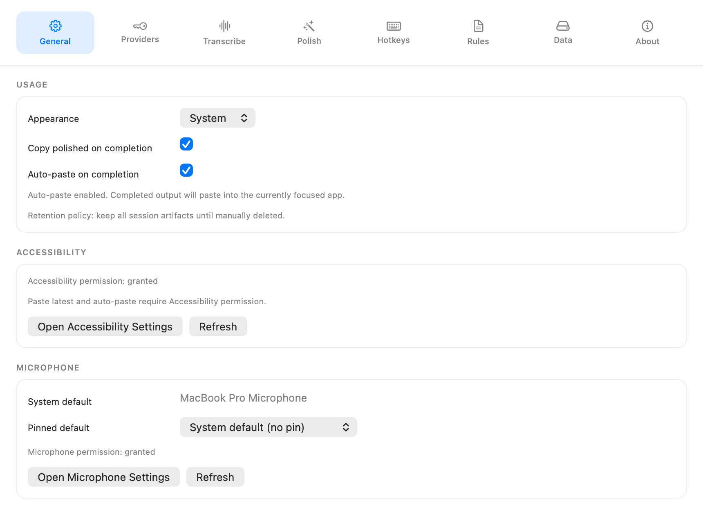
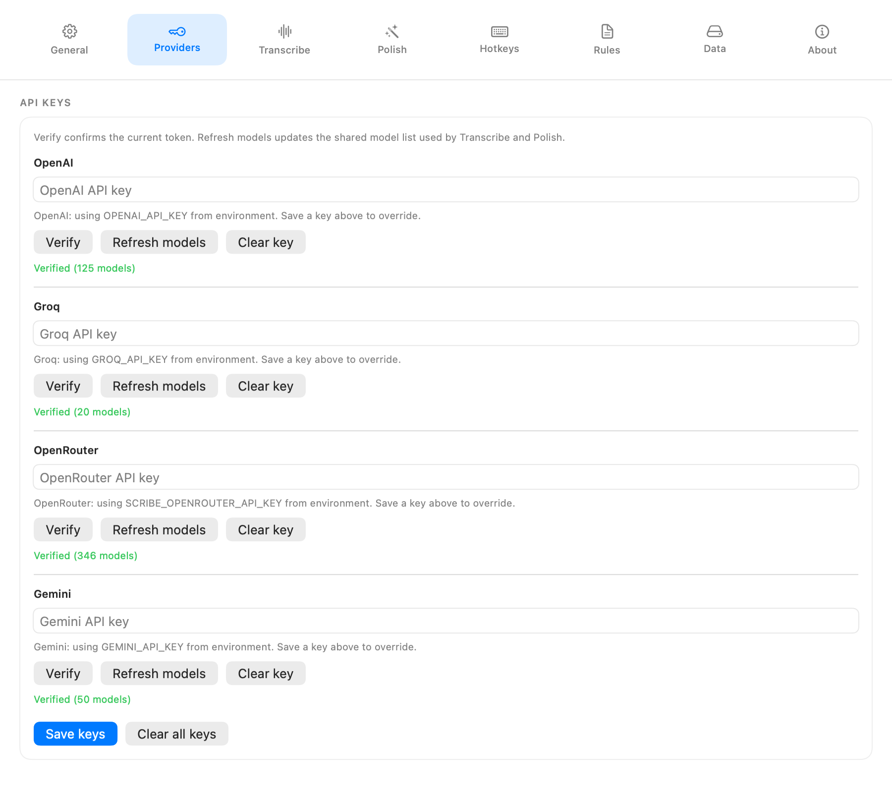
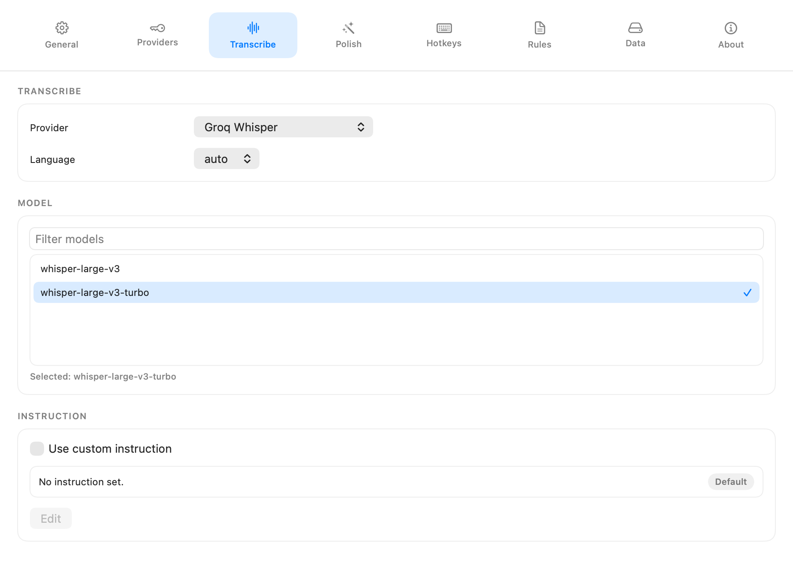
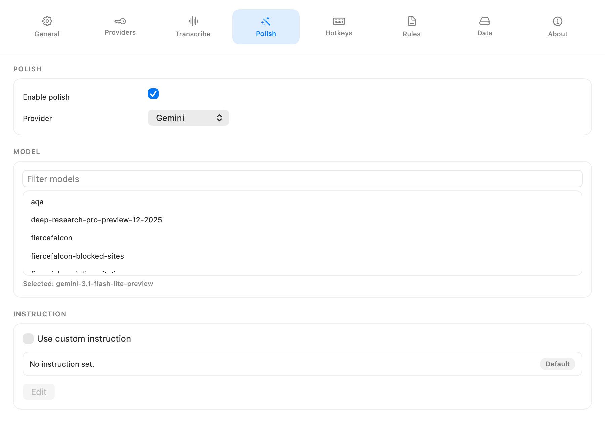
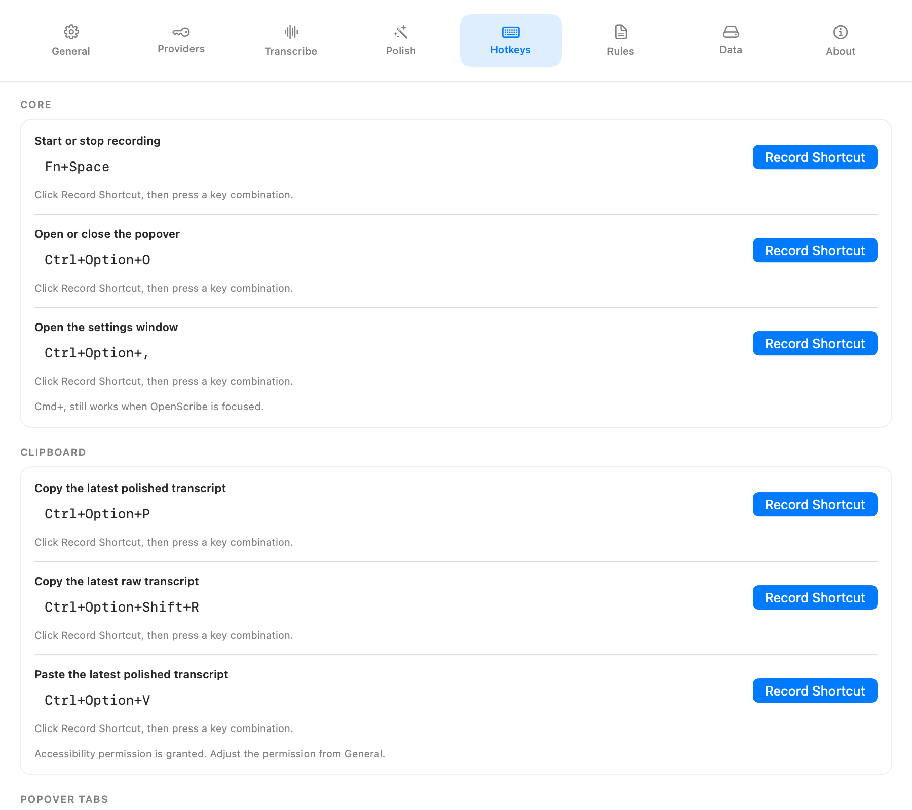
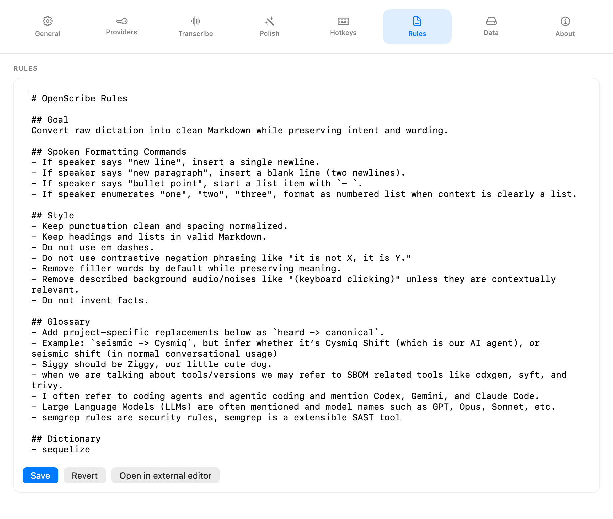
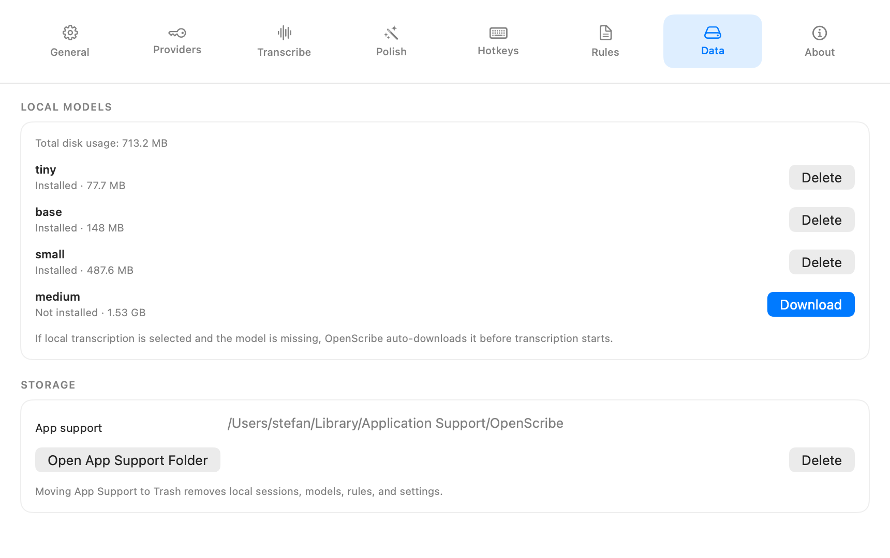
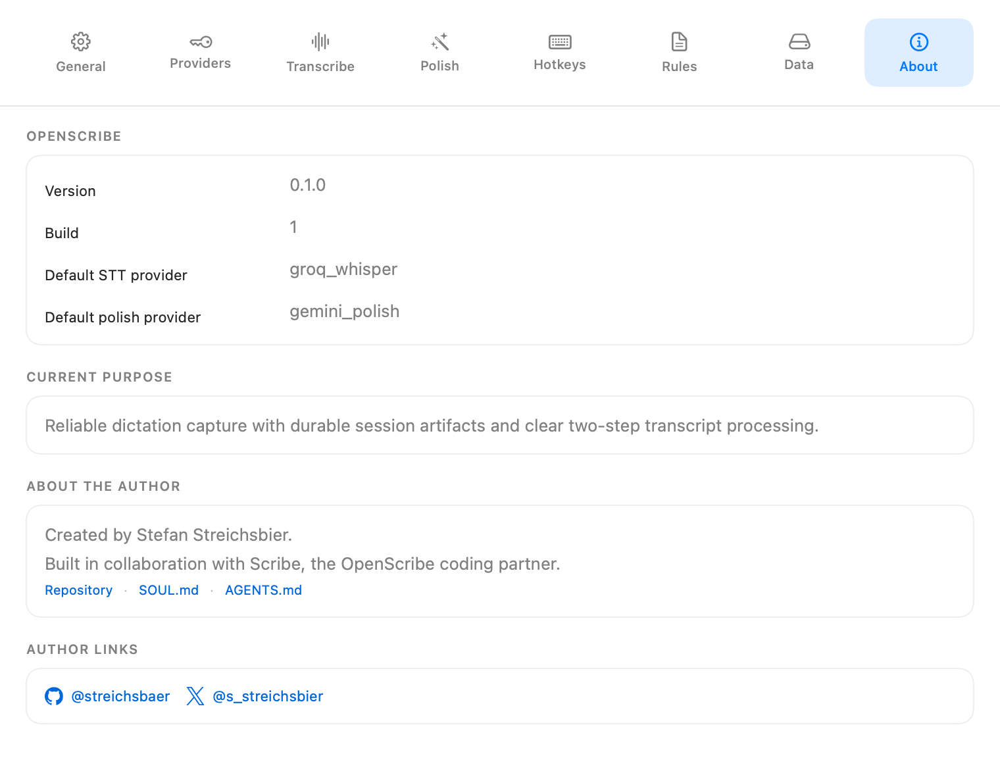

# Menu and Settings

This page is the user-facing reference for OpenScribe menu behavior, popover tabs, and all Settings tabs.

## Menu bar behavior

- Left click on the menu bar icon toggles the popover.
- Right click on the menu bar icon opens a menu with:
  - `Settings`
  - `Quit OpenScribe`

## Menu bar icon states

### Idle

OpenScribe is ready and no active run is in progress.

{ .menu-icon }

### Recording (working)

Audio is currently being captured.

{ .menu-icon }

### Recording (no audio input)

Recording is active, but OpenScribe is not receiving usable microphone input.

{ .menu-icon }

### Transcribing

Audio capture is complete and speech-to-text is running.

{ .menu-icon }

### Polishing

Transcript polishing is running.

{ .menu-icon }

## Popover tabs

### Overview

### Live tab

- Shows the current run state and latest raw/polished text.
- Supports rerun actions for transcription and polish.

### History tab

- Lists previous sessions.
- Supports replay and opening the session folder in Finder.

### Stats tab

- Shows aggregate usage and recent-run metrics.

## Settings window

You can open Settings from the right-click menu, from `Cmd + ,` when OpenScribe is focused, or with the configured Open Settings hotkey.

### Full settings window

### General tab

- Appearance mode.
- Copy polished on completion.
- Auto-paste on completion.
- Accessibility permission status and controls.
- Microphone selection and permission controls.

### Providers tab

- API key management for OpenAI, Groq, OpenRouter, and Gemini.
- Verify the current token for each provider.
- Refresh shared provider model lists used by Transcribe and Polish.

### Transcribe tab

- Transcription provider selection.
- Full-width transcription model browser.
- Language mode.
- Optional custom transcription instruction.

### Polish tab

- Enable or disable polish.
- Polish provider.
- Full-width polish model browser.
- Optional custom polish instruction.

### Hotkeys tab

- Core shortcuts for recording, the popover, and settings.
- Clipboard shortcuts for copy latest, copy raw, and paste latest.
- Paste latest Accessibility dependency note.
- Popover tab shortcuts.

### Rules tab

- Edit the rules markdown used by polish.
- Save, revert, or open rules in an external editor.

### Data tab

- Install and delete local transcription models.
- View model disk usage.
- Open App Support folder.
- Move App Support data to Trash.

### About tab

- App version and build.
- Current default providers.
- Repository and governance links.

## Related references

- Product behavior contract: [Product Spec](../product/spec.md)
- Popover interaction details: [Popover Contract](../reference/popover-contract.md)
