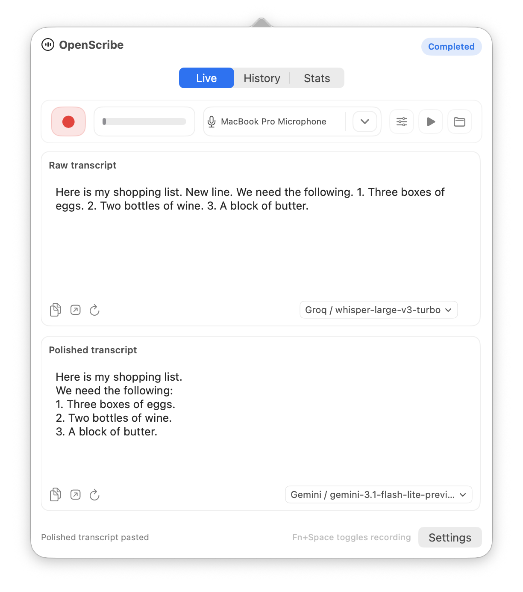
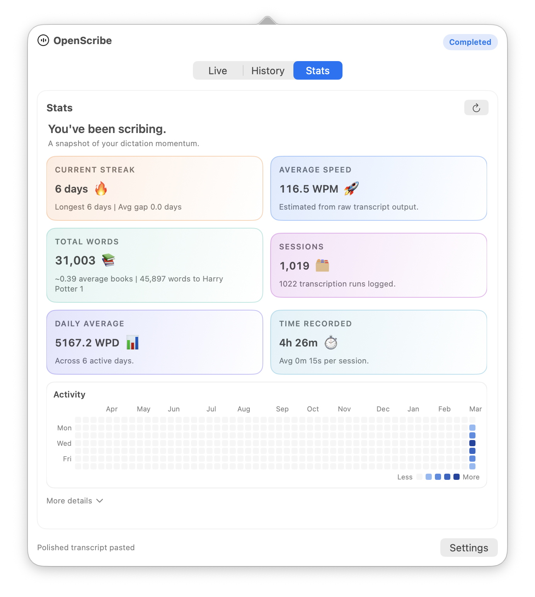

---
hide:
  - navigation
  - toc
title: OpenScribe
---

Speech to text. Fast. Local. Reliable.

OpenScribe is a native macOS menu bar app that captures your voice and turns it into usable text. Local-first by default, with optional cloud providers when you need them.

  <a href="https://github.com/streichsbaer/openscribe/releases/latest/download/OpenScribe-latest.zip" class="btn-primary">Download Latest</a>
  <a href="guides/getting-started/#install-with-homebrew" class="btn-secondary">Install with Homebrew</a>
  <a href="guides/getting-started/" class="btn-secondary">Get Started</a>

  

    <button class="hero-carousel-slide is-active" type="button" aria-label="Open screenshot: Speak, transcribe, polish">
      
    </button>
    <button class="hero-carousel-slide" type="button" aria-label="Open screenshot: Browse your session history">
      
    </button>
    <button class="hero-carousel-slide" type="button" aria-label="Open screenshot: Track your dictation momentum">
      
    </button>
  

  

    Speak, transcribe, polish
    Browse your session history
    Track your dictation momentum
  

  

    <button class="hero-carousel-dot is-active" type="button" aria-label="Show screenshot 1" aria-pressed="true"></button>
    <button class="hero-carousel-dot" type="button" aria-label="Show screenshot 2" aria-pressed="false"></button>
    <button class="hero-carousel-dot" type="button" aria-label="Show screenshot 3" aria-pressed="false"></button>
  

  
Tap or click a screenshot to enlarge it. Use arrow keys to browse and Escape to close.

  <button class="hero-lightbox__backdrop" type="button" aria-label="Close enlarged screenshot" aria-hidden="true" tabindex="-1"></button>
  

    <button class="hero-lightbox-close" type="button" aria-label="Close enlarged screenshot">Close</button>
    
    

  

### Local-first privacy

Your audio stays on your machine by default. You choose when and where to send data.

### Fast capture flow

Press a hotkey, speak, stop. Raw and polished text appear in seconds.

### Clear artifact model

Every session saves audio, raw transcript, and polished output. Replay or re-process any time.

---

### Use it

- [Getting Started](guides/getting-started.md)
- [Using Free Tiers](guides/free-tiers.md)
- [How It Works](guides/how-it-works.md)
- [Providers and Models](guides/providers.md)
- [UI Reference](reference/ui-reference.md)

### Build it

- [Product Spec](product/spec.md)
- [Roadmap](product/roadmap.md)
- [Contributing](product/contributing.md)
- [Development Setup](reference/development-setup.md)

