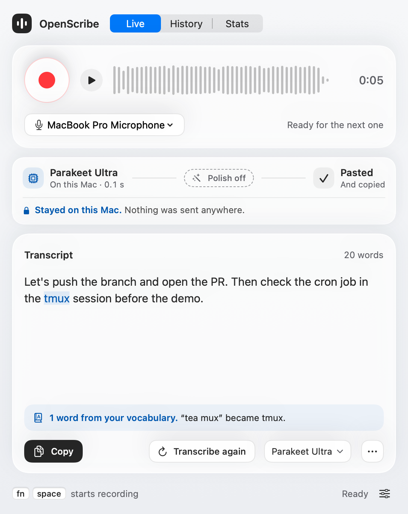
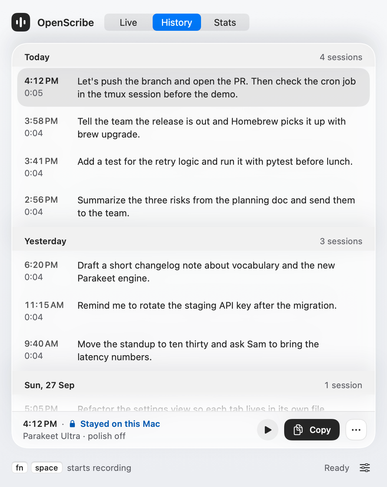
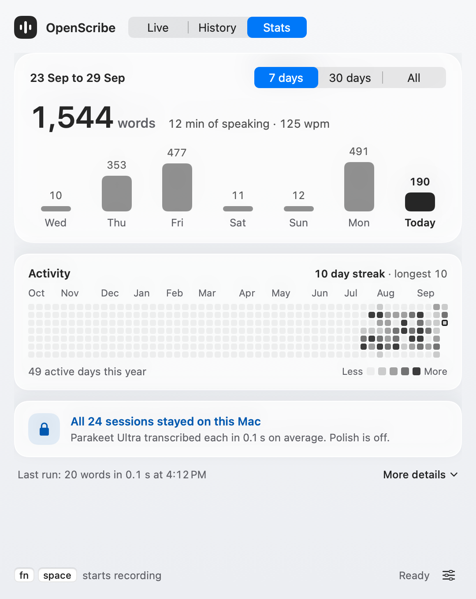

---
hide:
  - navigation
  - toc
title: OpenScribe
---

<section class="os-hero">
  <a class="os-announce" href="https://github.com/streichsbaer/openscribe/releases/tag/v0.4.0">
    New in 0.4.0
    A redesigned popover that shows where every recording went
    <svg viewBox="0 0 24 24" aria-hidden="true"><path d="M9 6l6 6-6 6"/></svg>
  </a>
  <h1 class="os-title">Dictation for your Mac.Fast. Local. Reliable.</h1>
  
Press a hotkey, speak, and OpenScribe types for you. It transcribes on your Mac by default and only uses the cloud when you choose to.

  

    <a class="os-btn os-btn--primary" href="https://github.com/streichsbaer/openscribe/releases/latest/download/OpenScribe-latest-arm64.zip">
      <svg viewBox="0 0 24 24" aria-hidden="true"><path d="M12 4v11M7 10l5 5 5-5M5 20h14"/></svg>
      Download for Apple silicon
    </a>
    <a class="os-btn os-btn--ghost" href="https://github.com/streichsbaer/openscribe/releases/latest/download/OpenScribe-latest-x86_64.zip">Intel Mac</a>
  

  

    <code>$ brew install --cask streichsbaer/tap/openscribe</code>
    <button class="os-copy" type="button" data-copy="brew install --cask streichsbaer/tap/openscribe" aria-label="Copy command">
      <svg class="os-copy__idle" viewBox="0 0 24 24" aria-hidden="true"><rect x="8" y="8" width="11" height="11" rx="2.5"/><path d="M5 15.5V7a2 2 0 0 1 2-2h8.5"/></svg>
      <svg class="os-copy__done" viewBox="0 0 24 24" aria-hidden="true"><path d="M5.5 12.5l4 4L18.5 7.5"/></svg>
    </button>
  

  
Free&nbsp;and&nbsp;open&nbsp;sourcemacOS&nbsp;14&nbsp;or&nbsp;laterNo&nbsp;account&nbsp;needed

</section>

<section class="os-video">
  <video muted loop playsinline preload="auto" poster="assets/openscribe-0.4.0-poster.jpg" aria-label="OpenScribe 0.4.0 launch video: a recording turns into text on this Mac, then History and Stats">
    <source src="assets/openscribe-0.4.0.mp4" type="video/mp4">
  </video>
  <button class="os-video__play" type="button" aria-label="Play video">
    <svg viewBox="0 0 24 24" aria-hidden="true"><path d="M8 5.5v13l10.5-6.5z"/></svg>
  </button>
  <button class="os-video__sound" type="button" aria-pressed="false">
    <svg viewBox="0 0 24 24" aria-hidden="true"><path d="M4 9.5h3.5L12 5.5v13l-4.5-4H4z"/><path d="M15.5 9a4 4 0 0 1 0 6M18 6.5a7.5 7.5 0 0 1 0 11"/></svg>
    Sound on
  </button>
</section>

<section class="os-section">
  
How it works

  <h2 class="os-h2">Talk anywhere you can type.</h2>
  

    

      
<kbd>fn</kbd><kbd class="wide">space</kbd>

      <h3>Press your hotkey</h3>
      
Start and stop from any app. The keys are yours to choose.

    

    

      
<i></i><i></i><i></i><i></i><i></i><i></i><i></i><i></i><i></i><i></i><i></i><i></i><i></i><i></i><i></i><i></i>

      <h3>Speak naturally</h3>
      
A live waveform shows OpenScribe is listening. Stop when you are done.

    

    

      
Push the branch, then restart the <mark>tmux</mark> session.

      <h3>Text lands where you type</h3>
      
Your words are pasted into the app you were using and copied to the clipboard.

    

  

</section>

<section class="os-section">
  
What is inside

  <h2 class="os-h2">Private by default, and clear about it.</h2>
  

    <article class="os-card os-card--wide os-card--split">
      

        
<svg viewBox="0 0 24 24" aria-hidden="true"><rect x="5" y="10.5" width="14" height="10" rx="2.6"/><path d="M8.2 10.5V8a3.8 3.8 0 0 1 7.6 0v2.5"/></svg>

        <h3>Stays on your Mac</h3>
        
Parakeet Ultra transcribes right on your Mac, in about 0.07 s for 30 s of speech on an M5 Max. Every session shows its route, so you can see that nothing was sent anywhere.

        
Stayed on this Mac. Nothing was sent anywhere.

      

      

        
      

    </article>
    <article class="os-card">
      
<svg viewBox="0 0 24 24" aria-hidden="true"><path d="M6 4.5h10.5a2 2 0 0 1 2 2V19.5H8a2 2 0 0 1-2-2z"/><path d="M6 17.5a2 2 0 0 1 2-2h10.5"/><path d="M10 8.5h5"/></svg>

      <h3>Knows your words</h3>
      
Developer terms like tmux, zsh and cron come built in. Add your own, and OpenScribe fixes the spelling as you speak.

      
<s>tea mux</s><svg viewBox="0 0 24 24" aria-hidden="true"><path d="M5 12h13M13 7l5 5-5 5"/></svg><b>tmux</b>

    </article>
    <article class="os-card">
      
<svg viewBox="0 0 24 24" aria-hidden="true"><rect x="6" y="6" width="12" height="12" rx="2.6"/><rect x="9.6" y="9.6" width="4.8" height="4.8" rx="1"/><path d="M9.5 3v3M14.5 3v3M9.5 18v3M14.5 18v3M3 9.5h3M3 14.5h3M18 9.5h3M18 14.5h3"/></svg>

      <h3>Your engine, your call</h3>
      
Local engines need no account. Cloud providers use your own API key, kept in the Keychain.

      <ul class="os-chips">
        <li class="local">Parakeet Ultra</li><li class="local">Whisper on the GPU</li><li class="cloud">Groq</li><li class="cloud">OpenAI</li><li class="cloud">Gemini</li><li class="cloud">OpenRouter</li>
      </ul>
    </article>
    <article class="os-card os-card--shot-bottom">
      <h3>Every session, kept</h3>
      
Audio, transcript and timings are saved for each session. Play it, copy it, or transcribe it again with another model.

      

        
      

    </article>
    <article class="os-card os-card--shot-bottom">
      <h3>See your momentum</h3>
      
Words per day, your speaking pace, and a year of activity with your streak.

      

        
      

    </article>
  

</section>

<section class="os-numbers" aria-label="OpenScribe in numbers">
  
<strong>0.07 s</strong>to transcribe 30 s of speech on an M5 Max

  
<strong>25</strong>languages with Parakeet Ultra

  
<strong>64</strong>developer terms built in

  
<strong>MIT</strong>open source license

</section>

<section class="os-final">
  <h2>Start dictating in a minute.</h2>
  
Download OpenScribe, grant microphone access, and press your hotkey.

  

    <a class="os-btn os-btn--light" href="https://github.com/streichsbaer/openscribe/releases/latest/download/OpenScribe-latest-arm64.zip">Download for Apple silicon</a>
    <a class="os-btn os-btn--outline" href="guides/getting-started/">Read the setup guide</a>
  

  
Intel Mac? <a href="https://github.com/streichsbaer/openscribe/releases/latest/download/OpenScribe-latest-x86_64.zip">Download the Intel build</a>. Not sure which Mac you have? Open Apple menu &gt; About This Mac.

</section>

<section class="os-paths">
  

    <h3>Use it</h3>
    <a href="guides/getting-started/">Getting Started</a>
    <a href="guides/how-it-works/">How It Works</a>
    <a href="guides/vocabulary/">Vocabulary</a>
    <a href="guides/free-tiers/">Using Free Tiers</a>
    <a href="guides/providers/">Providers and Models</a>
    <a href="reference/ui-reference/">UI Reference</a>
  

  

    <h3>Build it</h3>
    <a href="product/spec/">Product Spec</a>
    <a href="product/roadmap/">Roadmap</a>
    <a href="product/contributing/">Contributing</a>
    <a href="reference/development-setup/">Development Setup</a>
    <a href="https://github.com/streichsbaer/openscribe">Source on GitHub</a>
  

</section>

